# Mermaid

See [Material for MkDocs diagrams documentation](https://squidfunk.github.io/mkdocs-material/reference/diagrams/)
for a complete reference.

Those examples are extracted from the [Mermaid documentation](https://mermaid.js.org/syntax/)
and are the most complexes found to showcase all styles and possibilities.

Some have a `Syntax error in graph` instead of the diagram:
it means that `mkdocs-material`'s `mermaid.js` version does not support them yet.

## Flowchart

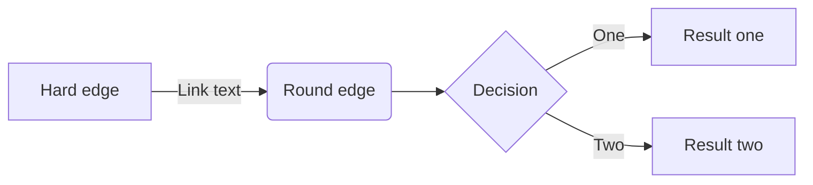

## Sequence diagram

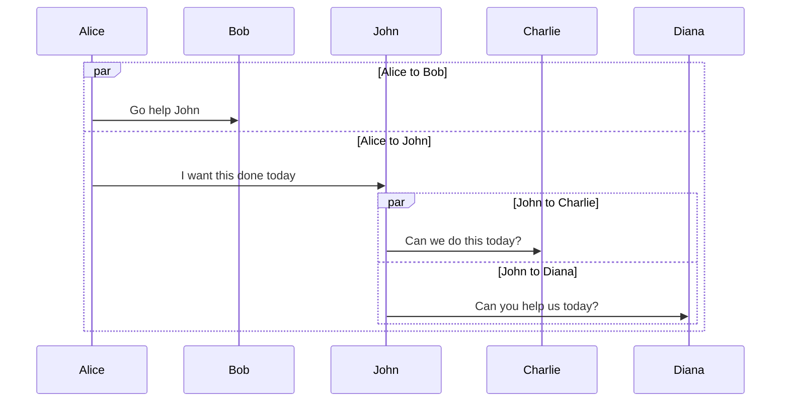

## Class diagram

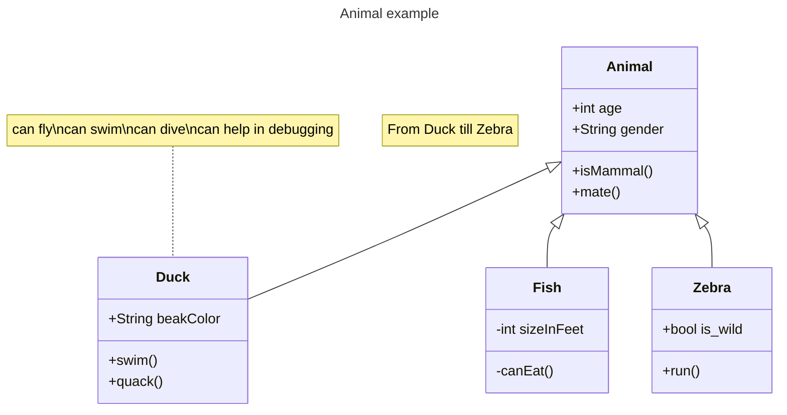

## State diagram

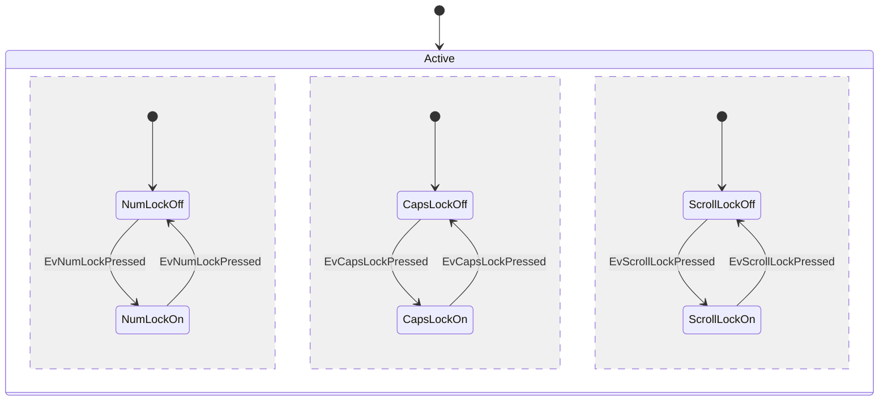

### Entity Relationship diagram

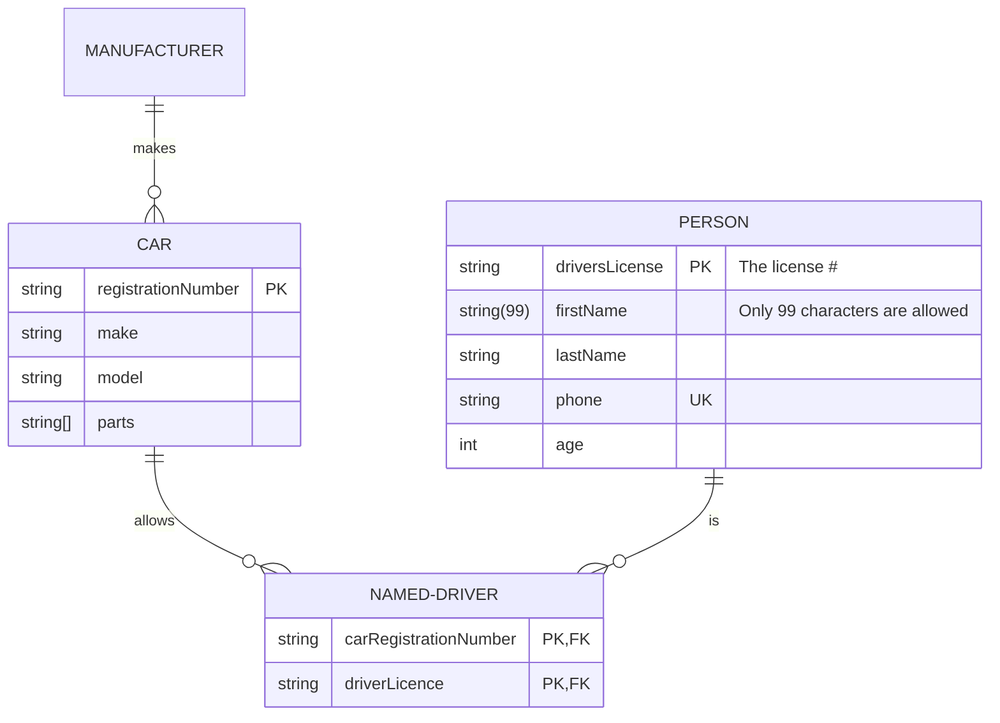

### Gantt

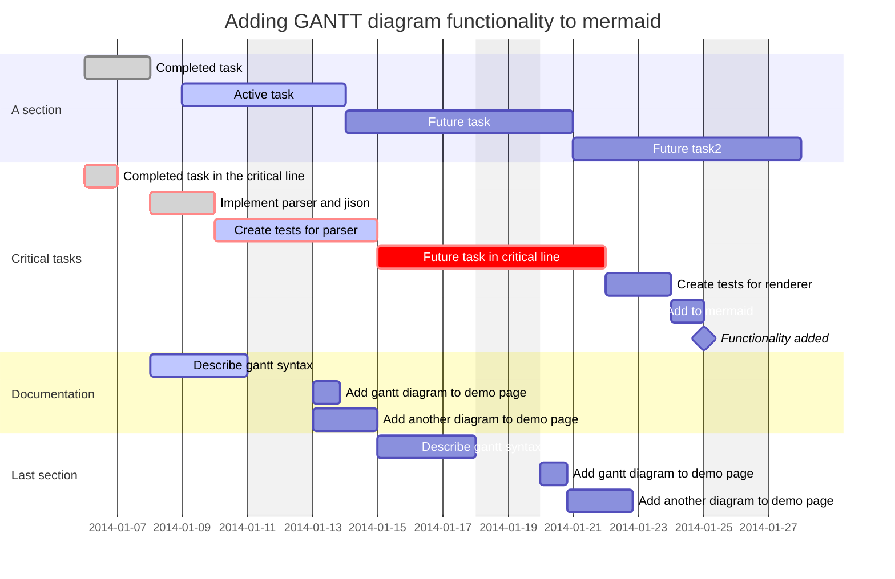

## Pie Chart

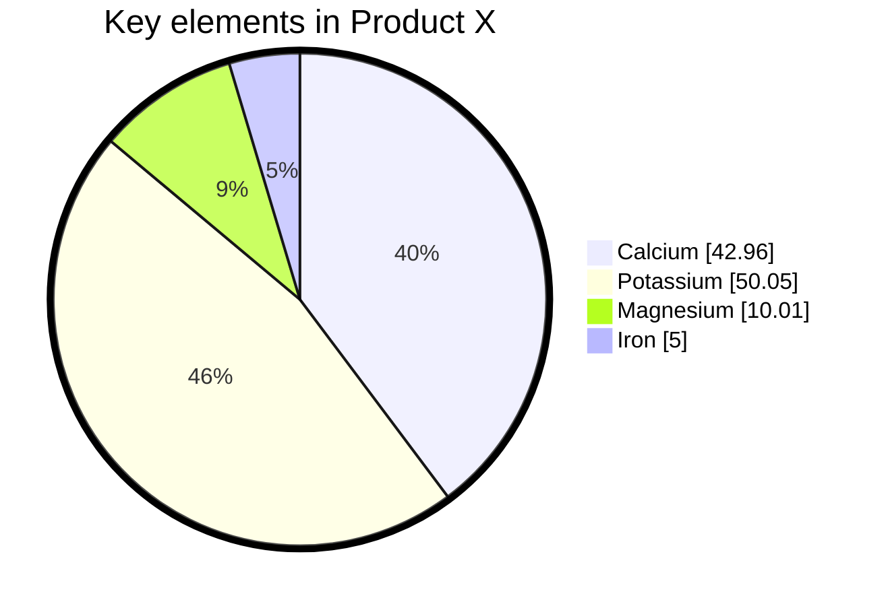

## Requirement Diagram

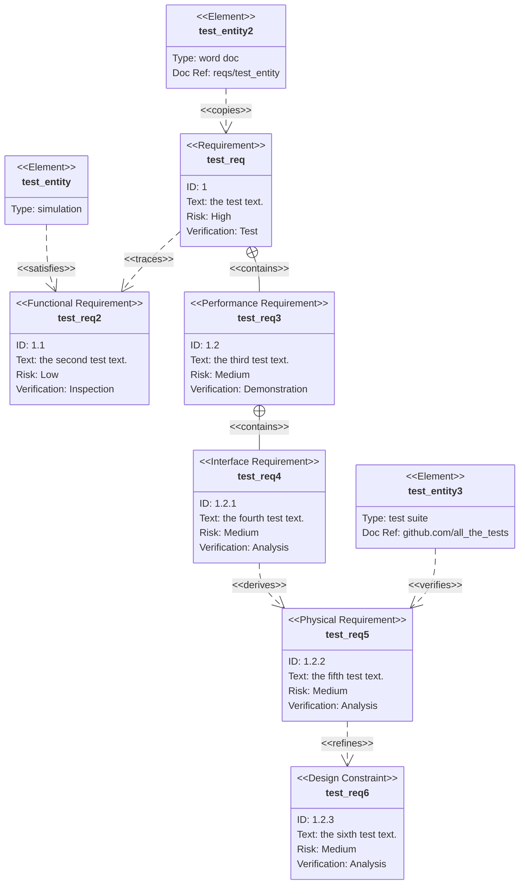

## GitGraph

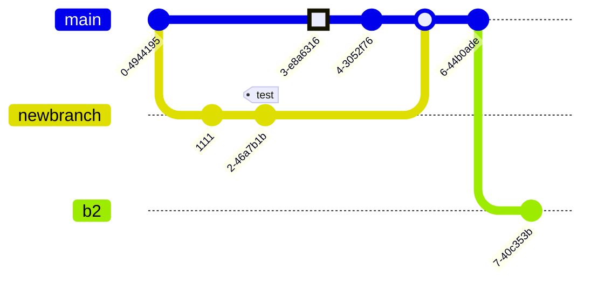

## C4 Diagrams

### System Context

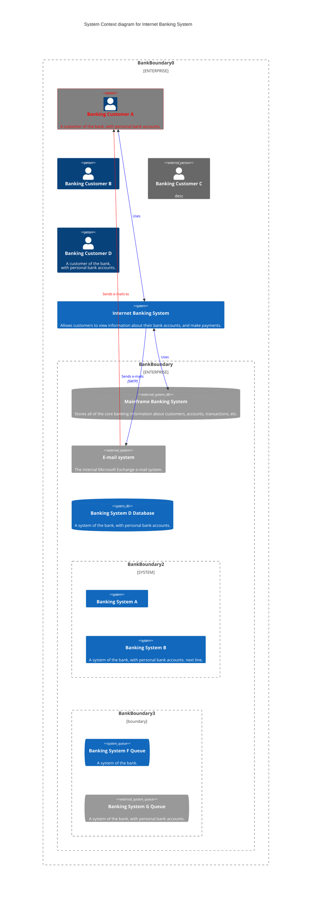

### Container

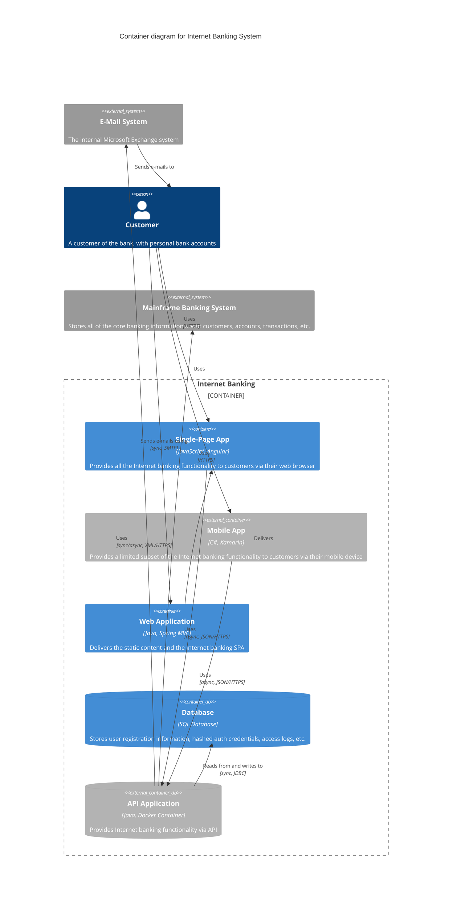

### Component

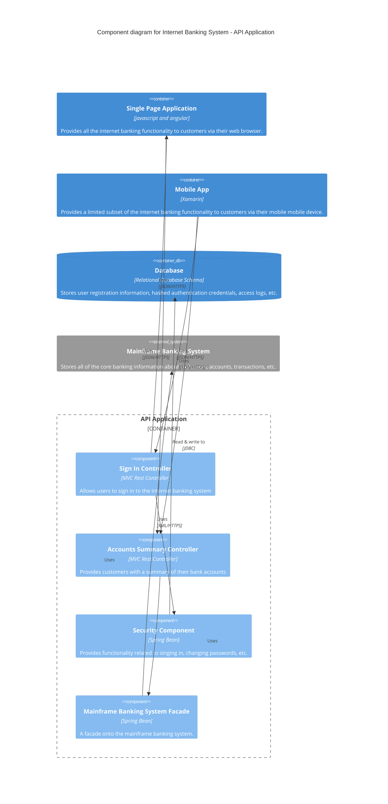

### Dynamic

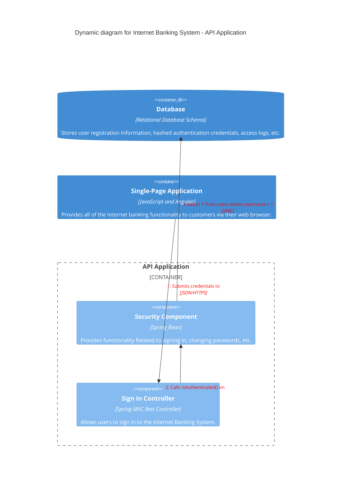

### Deployment

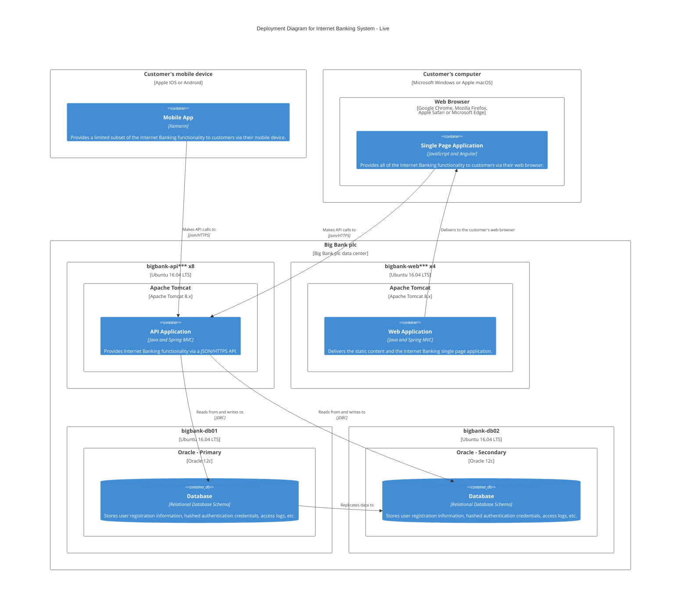

## Mindmaps

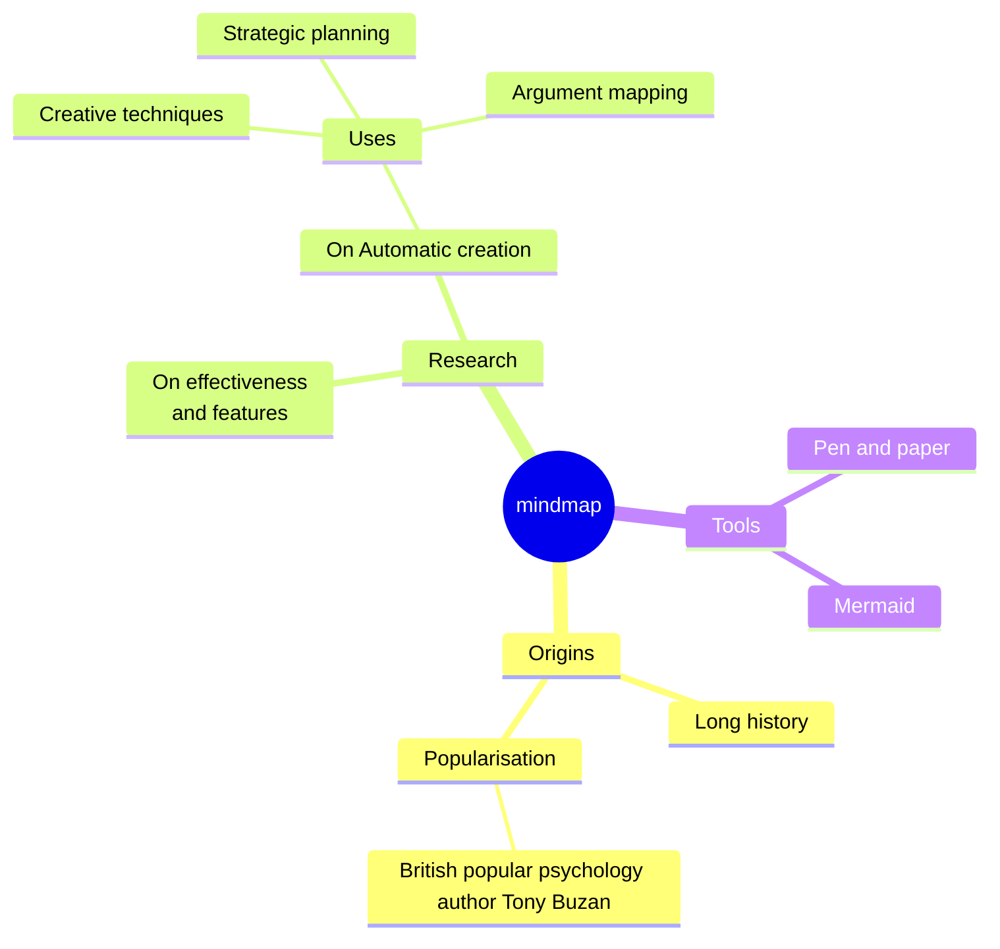

## Timeline

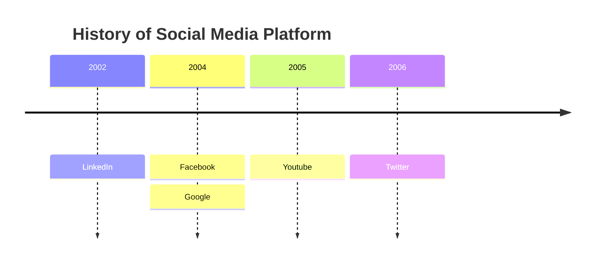
